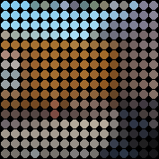

<div align="center">

# 💡 LED Animator

### Turn any video into a tiny, glowing light show.

LED Animator transforms ordinary videos into colorful animations for
**16×16** and **48×48** RGB LED displays—complete with shareable previews and
ready-to-use animation data.

<p>
  
  
  
</p>

**[See the results](#-see-it-in-action)** ·
**[Discover what it does](#-from-video-to-light)** ·
**[Meet the AI robot](#-made-for-expressive-ai-robots)** ·
**[Run it yourself](#-run-it-yourself)**

</div>

---

## ✨ See it in action

<p align="center">
  <a href="output/cs2_256x256.preview.mp4">
    
  </a>
  <br>
  <sub><strong>Click the animation to watch the smooth 60 FPS version.</strong></sub>
</p>

<table>
  <tr>
    <td align="center" width="50%">
      <a href="output/cs2.preview.gif">
        
      </a>
      <br>
      <strong>Full animation</strong>
      <br>
      <sub>A complete video reimagined as light</sub>
    </td>
    <td align="center" width="50%">
      <a href="output/test1.preview.gif">
        
      </a>
      <br>
      <strong>Quick loop</strong>
      <br>
      <sub>A compact glimpse of the LED effect</sub>
    </td>
  </tr>
</table>

### Watch in full quality

| Experience | Best for | Watch |
| :-- | :-- | :--: |
| **16×16 LED display** · 256×256 preview | The classic pixel-grid look | [▶ Open the MP4](output/cs2_256x256.preview.mp4) |
| **48×48 LED display** · 482×482 preview | More detail and smoother shapes | [▶ Open the MP4](output/cs2_48x48.preview.mp4) |

> [!TIP]
> The GIFs play instantly on GitHub. The MP4 versions are smoother, sharper,
> and much smaller than an equivalent full-quality GIF.

## 🎬 From video to light

LED Animator takes the motion, color, and feeling of a video and translates it
into a grid of glowing RGB lights.

<table>
  <tr>
    <td align="center" width="25%">
      <h3>① 🎥</h3>
      <strong>Choose a video</strong>
      <br><sub>Clips, art, loops, faces, or motion graphics</sub>
    </td>
    <td align="center" width="25%">
      <h3>② ✂️</h3>
      <strong>Focus the frame</strong>
      <br><sub>The center is cropped into a perfect square</sub>
    </td>
    <td align="center" width="25%">
      <h3>③ 🌈</h3>
      <strong>Blend the colors</strong>
      <br><sub>Every area becomes one expressive RGB LED</sub>
    </td>
    <td align="center" width="25%">
      <h3>④ ✨</h3>
      <strong>Bring it to life</strong>
      <br><sub>Preview it, play it, or send it to hardware</sub>
    </td>
  </tr>
</table>

The result keeps the character of the original video while embracing the
bold, charming look of a real LED panel.

## 🌟 Why it feels different

- **Tiny details still glow.** Colors are blended by area, so a small bright
  object influences the final LED instead of simply disappearing.
- **The preview looks like real light.** Bright centers, circular LED faces,
  and soft colored halos make the simulation feel photographed—not flat.
- **Long videos stay manageable.** Frames flow through the converter one at a
  time instead of filling your computer's memory.
- **Your original colors stay honest.** The glow is only added to the visual
  preview; the saved RGB values remain untouched.
- **A failed export stays tidy.** Finished files appear together, so an error
  cannot leave a confusing mix of old and new results.

## 🔲 One idea, two canvases

| | **16×16** | **48×48** |
| :-- | :-- | :-- |
| **Personality** | Bold, iconic, unmistakably pixelated | Detailed, fluid, and expressive |
| **Great for** | Badges, desk displays, signs, simple characters | Robot faces, wall panels, art pieces, richer motion |
| **Preview size** | 256×256 | 482×482 |
| **Best starting point** | First experiments and compact hardware | Final displays that need more visual detail |

Both versions preserve full RGB color: every LED can display more than
**16.7 million colors**.

## 📦 More than a preview

Each conversion can produce three useful versions of the same animation:

| Result | What it gives you |
| :-- | :-- |
| **Visual preview** `.preview.mp4` | A polished H.264 video that is easy to watch and share |
| **Compact animation** `.ledanim.npz` | Small, lossless data for playback software and future LED board drivers |
| **Portable LED map** `.ledmap.json` | Clearly structured colors and timing for other apps, devices, and microcontrollers |
| **Arduino binary** `.ledbin` | Compact RGB565 frames that an ESP32 can play without parsing JSON or NPZ |

This means one source video can move naturally from an idea on your screen to
an animation on physical hardware.

## 🤖 Made for expressive AI robots

An AI can speak with words—but a robot feels far more alive when it can also
communicate with **light, color, and motion**.

LED Animator can turn short videos and motion designs into a library of visual
expressions for an LED-powered robot face or status panel:

| When the robot is… | Its LEDs could show… |
| :-- | :-- |
| **Listening** | A calm blue pulse or attentive eyes |
| **Thinking** | A flowing orbit, shifting gradient, or playful loading loop |
| **Speaking** | Rhythmic color, animated mouth shapes, or energetic waves |
| **Happy** | Bright eyes, warm colors, sparkles, or a tiny celebration |
| **Unsure** | A questioning glance, gentle flicker, or changing expression |
| **Resting** | Slow breathing light that makes the robot feel present |

The robot's AI can choose the right saved animation for each moment, while LED
Animator handles the visual conversion and hardware-friendly frame data.

> [!NOTE]
> LED Animator prepares the expressions; it does not include an AI model or a
> robot controller. Think of it as the visual bridge between your robot's
> personality and its LED display.

## 🚀 Run it yourself

Everything needed to try the project is below. No setup commands are required
until this point.

### What you need

- Python 3.10 or newer
- FFmpeg, with `ffmpeg` and `ffprobe` available on your `PATH`
- Docker for the recommended, memory-limited 48×48 workflow

### 1. Download and install

```bash
git clone https://github.com/Veguinho/led_animator.git
cd led_animator

python3 -m venv .venv
source .venv/bin/activate
python3 -m pip install -r requirements.txt
```

### 2. Add a video

Place a video inside `video_clips/`, then create a 16×16 animation:

```bash
python3 led_animator.py video_clips/my_video.mp4 -o output/my_animation
```

For a 48×48 animation, use the protected Docker runner:

```bash
./run_48_container.sh video_clips/my_video.mp4 -o output/my_animation_48
```

The runner limits the conversion to 1 GiB of memory, two CPU cores, and no
network access. You can raise those limits when needed:

```bash
LED_ANIMATOR_MEMORY_LIMIT=2g LED_ANIMATOR_CPU_LIMIT=4 \
  ./run_48_container.sh video_clips/my_video.mp4 -o output/my_animation_48
```

### 3. Play the result

```bash
python3 led_animator.py --play output/my_animation.ledanim.npz
```

### Useful options

| What you want | Command |
| :-- | :-- |
| Convert, then open the desktop player | `python3 led_animator.py input.mp4 --preview-after` |
| Create only the compact animation | `python3 led_animator.py input.mp4 --no-json --no-preview` |
| Change LED size and spacing | `python3 led_animator.py input.mp4 --led-size 28 --gap 3` |
| Make the MP4 preview lighter | `python3 led_animator.py input.mp4 --preview-fps 10` |
| Use less memory during compression | `python3 led_animator_48.py input.mp4 --batch-size 4` |
| Rebuild a preview from saved animation data | `./run_48_container.sh --preview-from output/my_animation.ledanim.npz -o output/my_animation` |

For especially long 48×48 videos, skip the larger JSON and visual preview:

```bash
./run_48_container.sh video_clips/long_video.mp4 \
  -o output/long_video_48 --no-json --no-preview --batch-size 4
```

### Use the animation data

```python
import numpy as np

with np.load("output/my_animation.ledanim.npz") as animation:
    frames = animation["frames"]  # (frame_count, grid, grid, 3), uint8
    fps = float(animation["fps"])

for frame in frames:
    # Send one row-major RGB frame to your LED board here.
    send_to_board(frame.reshape(-1, 3))
```

JSON frames follow `frames[frame][row][column][channel]`, starting at the
top-left with RGB channel values from `0` through `255`.

### Export for Arduino or ESP32

JSON is convenient for exchanging data but wasteful on a microcontroller, and
NPZ requires a ZIP/NumPy decoder. Export a 16×16 animation as RGB565 binary
instead:

```bash
python3 export_arduino.py output/my_animation.ledmap.json \
  -o output/my_animation_16x16.ledbin \
  --fps 12 \
  --header my_animation_player/my_animation.h \
  --symbol my_animation
```

The `.ledbin` contains a 24-byte little-endian header followed by row-major
RGB565 frames. The optional header embeds the same bytes in flash with
`PROGMEM`, so no SD card or runtime filesystem is required. See
`cs2_16x16_player/` for a FastLED player; set its data pin and serpentine layout
to match the panel before uploading.

### Run the tests

```bash
python3 -m unittest discover -s tests -v
```

---

<p align="center">
  <strong>Small grid. Big personality.</strong><br>
  <sub>Built for glowing art, playful hardware, and robots that deserve expressions.</sub>
</p>
