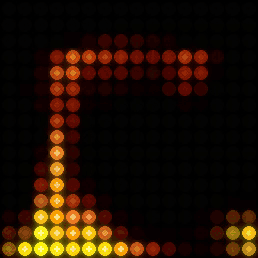
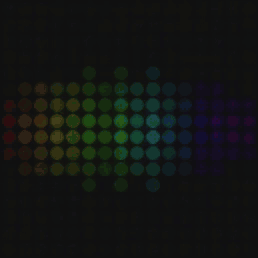
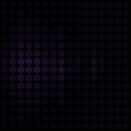

# 💡 LED Animator

Live lava, audio-reactive waves, and video playback on a **16×16 RGB LED
panel**. Python creates the frames; an ESP32-S3 drives the LEDs over USB.
The video converter also supports **48×48** grids.

[Quick start](#quick-start) · [Hardware](docs/hardware.md) ·
[Live streaming](docs/live-streaming.md) · [Video conversion](docs/video-conversion.md)

## See it in motion

<table>
  <tr>
    <td align="center" width="50%">
      <a href="docs/assets/lava-lamp.mp4">
        
      </a>
      <br><strong>Lava lamp</strong>
      <br>Heat, buoyancy, and fluid motion.
      <br><a href="docs/assets/lava-lamp.mp4">Watch the MP4</a>
    </td>
    <td align="center" width="50%">
      <a href="docs/assets/audio-spectrum.mp4">
        
      </a>
      <br><strong>Live audio spectrum</strong>
      <br>Rainbow frequency bars follow the music.
      <br><a href="docs/assets/audio-spectrum.mp4">Watch with sound</a>
    </td>
  </tr>
  <tr>
    <td align="center" colspan="2">
      <a href="docs/assets/audio-adaptive.mp4">
        
      </a>
      <br><strong>Adaptive audio spectrum</strong>
      <br>Warm, vivid colors for energetic passages; softer Ocean colors for quieter sections.
      <br><a href="docs/assets/audio-adaptive.mp4">Watch with sound</a>
    </td>
  </tr>
</table>

The audio previews use real Mac system audio recorded during playback.
Adaptive captures the running visualizer's live frames at 60% brightness and
20% slowdown. Both audio MP4s include the recorded sound; the inline GIFs are
silent. The lava is a seeded fluid simulation.
[Record or rebuild the previews](docs/development.md#readme-previews).

## What you can run

| Mode | Input | Command after setup |
| :-- | :-- | :-- |
| Lava lamp | Procedural fluid simulation | `python3 lava_lamp_stream.py --clear-on-exit` |
| Audio wave | macOS system audio | `python3 system_audio_visualizer.py --style wave --clear-on-exit` |
| Audio spectrum | macOS system audio | `python3 system_audio_visualizer.py --style spectrum --clear-on-exit` |
| Video stream | Local video decoded with FFmpeg | `python3 stream_arduino.py video_clips/my_video.mp4 --loop --clear-on-exit` |
| Video conversion | Local video | `python3 led_animator.py video_clips/my_video.mp4 -o output/my_animation` |

## Quick start

Use Python 3.10 or newer. Live system audio requires **macOS 14.2+** and Apple's
Command Line Tools. Video conversion and preview generation require **FFmpeg**.

```bash
git clone https://github.com/Veguinho/led_animator.git
cd led_animator
python3 -m venv .venv
source .venv/bin/activate
python3 -m pip install -r requirements.txt
```

For physical playback, follow the [wiring and firmware setup](docs/hardware.md)
for an ESP32-S3 and a 16×16 WS2812B matrix with a separate 5 V supply and
common ground. After installing the firmware prerequisites, upload and
start the audio wave:

```bash
./start.sh --style wave
```

Allow **System Audio Recording Only** for your terminal when macOS asks.
Screen recording permission is not needed.
For later runs, skip the upload with `./start.sh --no-upload --style wave`.
Running `./start.sh` without a style selects the spectrum.

To switch to lava, stop the audio stream with Ctrl+C, then run:

```bash
python3 lava_lamp_stream.py --clear-on-exit
```

No panel is needed to [convert videos](docs/video-conversion.md) or
[render the documentation previews](docs/development.md#readme-previews).

## Documentation

- [Hardware and firmware](docs/hardware.md): wiring, power, board setup, upload.
- [Live streaming](docs/live-streaming.md): lava, wave, spectrum, video, and troubleshooting.
- [Video conversion](docs/video-conversion.md): 16×16 and 48×48 workflows, Docker, data formats, Arduino export.
- [Development](docs/development.md): tests, project structure, and preview generation.

Only the small documentation previews are versioned. Source videos, exported
animations, and generated firmware animation headers stay out of Git.
