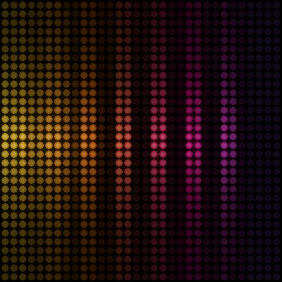

# 32×32 mode preview

[← README](../README.md) · [Hardware and firmware](hardware.md) · [Live streaming](live-streaming.md)



This is a software rendering of one native 32×32 spectrum frame. Every circle
represents one independently addressed LED. The spectrum uses all 32 frequency
columns and grows outward from the two center rows. The image uses the same
`AudioVisualizer`, Sunset palette, and circular LED renderer as the live app;
the deterministic multi-tone input keeps the checked-in image reproducible.

The live app sends frames in row-major order from the logical top-left corner.
The four physical 16×16 panels form this screen when viewed from the front:

| | Left | Right |
| :-- | :-- | :-- |
| Top | IO11 | IO10 |
| Bottom | IO13 | IO12 |

The firmware mirrors IO11 and IO13 within their own 16×16 areas to compensate
for their physical orientation. That transform happens after the preview, so
the browser and this image remain one continuous logical 32×32 canvas.

To see the live preview without changing the firmware, start or reuse the
background audio service and open the controls:

```bash
.venv/bin/python audio_service.py start --port /dev/cu.usbserial-1420
open http://127.0.0.1:8765
```

The live preview follows Mac system audio and always shows the exact logical
frame being sent. Physical output also passes through RGB565 conversion and the
firmware's brightness, pixel-intensity, and power limits.

Regenerate the checked-in image from the repository root with:

```bash
.venv/bin/python scripts/render_32x32_preview.py
```
