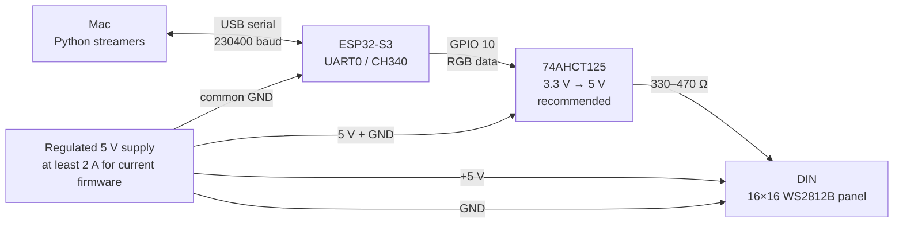

# Hardware setup

[← README](../README.md) · [Live streaming](live-streaming.md)

The live 16×16 build uses an ESP32-S3, a 256-pixel WS2812B matrix, and a
separate regulated 5 V supply. The Mac powers and programs the controller over
USB; the external supply powers the LEDs. All grounds must be connected.



| Connection | Wire it to |
| :-- | :-- |
| Mac USB | ESP32-S3 USB/CH340 connector |
| ESP32-S3 `GPIO 10` | Level-shifter input; output through a 330–470 Ω resistor to panel `DIN` |
| External supply `+5 V` | Panel `5V` input, not through the ESP32 or USB connector |
| External supply `GND` | Panel `GND`, ESP32 `GND`, and level-shifter `GND` |
| 1000 µF capacitor (recommended) | Across panel `5V` and `GND`, close to the power input |

> [!CAUTION]
> Never power all 256 LEDs from the ESP32 5 V pin or from USB. The current
> firmware uses global brightness `24/255` and FastLED's 2 A power limit. Use a
> larger supply and suitable power injection if you raise those limits. Do not
> feed the external supply's `+5 V` back into a USB-powered controller unless
> that specific board supports it.

The level shifter is strongly recommended for a robust installation because
the ESP32-S3 outputs 3.3 V logic while a 5 V WS2812B panel expects a higher
data-high level. Short test wiring may work without it, but is more sensitive
to cable length, noise, and supply voltage. The firmware maps logical rows to
the panel's serpentine chain, so the Python scripts always work with an ordinary
top-left, row-major 16×16 image.

## Firmware installation

Install Arduino CLI, the Espressif board package, and FastLED once:

```bash
brew install arduino-cli
arduino-cli core update-index --additional-urls https://espressif.github.io/arduino-esp32/package_esp32_index.json
arduino-cli core install esp32:esp32 --additional-urls https://espressif.github.io/arduino-esp32/package_esp32_index.json
arduino-cli lib install FastLED
```

See the [Arduino CLI setup guide](https://docs.arduino.cc/arduino-cli/getting-started/)
and [Espressif installation guide](https://docs.espressif.com/projects/arduino-esp32/en/latest/installing.html)
for platform-specific installation details.

From the repository root, with Python dependencies installed and the board
connected, upload the streaming sketch and start the audio wave:

```bash
./start.sh --style wave
```

The launcher selects `esp32:esp32:esp32s3` and detects the USB serial port.
Use `--port /dev/cu.usbserial-1410` to select a board, or `--fqbn` for a
different board profile. Run only one streamer per serial port at a time.
Stop the audio stream with Ctrl+C before switching to lava or video mode.

The sketch lives in
[`cs2_16x16_player_firmware/`](../cs2_16x16_player_firmware/cs2_16x16_player_firmware.ino).
Its historical folder name remains, but it receives live frames and contains
no bundled animation. The separate
[`ws2812_safe_test.ino/`](../ws2812_safe_test.ino/ws2812_safe_test.ino.ino)
sketch is a basic LED test, not the streaming receiver.
